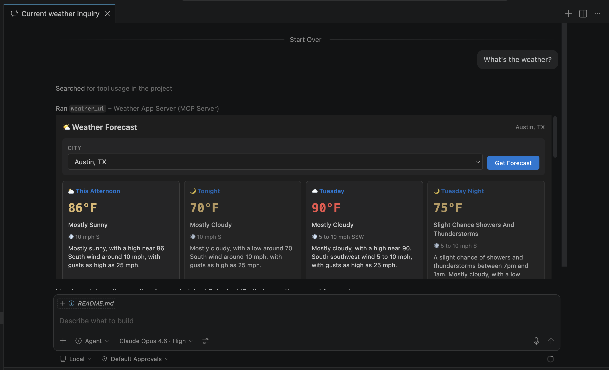

# Weather App Server

An MCP server that demonstrates the **MCP Apps** extension by serving an interactive weather forecast UI alongside weather tools.

## What it shows

- **`[McpAppUi]` attribute** — declaratively associates a UI resource with a tool
- **`WithMcpApps()`** — builder extension that processes `[McpAppUi]` attributes
- **UI resource** — an HTML page served via `McpServerResource` with MIME type `text/html;profile=mcp-app`
- **Structured content** — tool results include `StructuredContent` for the UI to render

## Running

```bash
dotnet run
```

The server starts on `http://localhost:5000` by default. Connect any MCP Apps-capable client to the `/mcp` endpoint.

Then prompt that will cause the LLM to request the use of the "weather_ui" tool.
A general prompt like "What's the weather?" will probably work, but if not you could try explicitly requesting the tool
with something like "@weather_ui". This should load the Weather App UI in an iFrame that you can then interact with
to get the weather forecast for a number of US cities.



## Tools

| Tool | Description |
|------|-------------|
| `weather_ui` | Opens the weather forecast UI |
| `weather_forecast` | Gets a multi-period forecast from the National Weather Service for a US city |

Both tools are linked to the `ui://weather-app/forecast` resource via the `[McpAppUi]` attribute.

## Resources

| URI | Description |
|-----|-------------|
| `ui://weather-app/forecast` | Interactive weather forecast HTML UI |
| `data://weather-app/us-cities` | JSON list of supported US cities |
